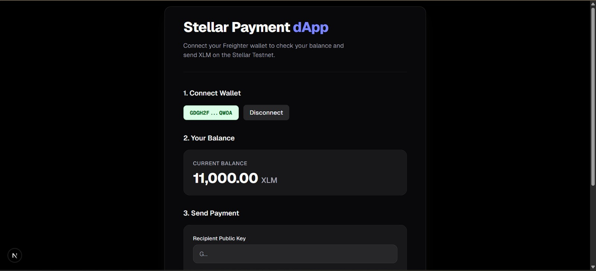
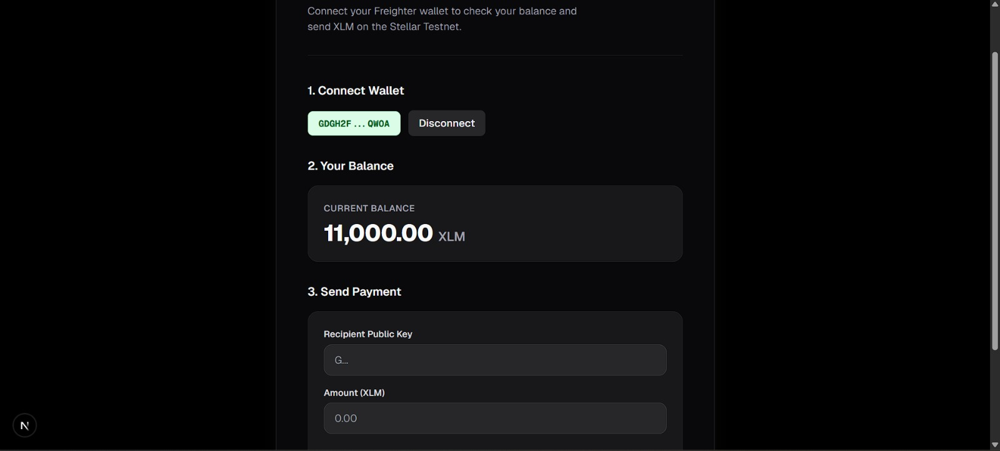
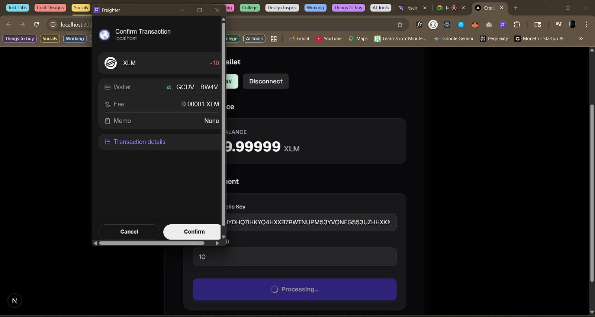
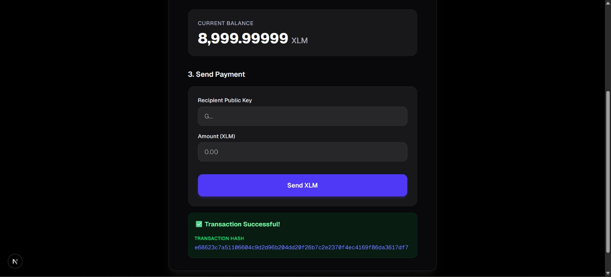

# Stellar Payment dApp 🚀

A full-stack Web3 application built for the **Stellar Journey to Mastery – White Belt Submission**. This dApp allows users to seamlessly connect their Freighter wallet, comfortably view their XLM balance, and send testnet XLM to friends instantly.

## 🌟 Features

- **Freighter Wallet Integration**: Connect and disconnect securely using the latest Freighter API.
- **Real-Time Balances**: Automatically fetches native XLM balances from the Stellar Testnet.
- **Unfunded Account Handling**: Graceful fallback UI linking directly to the Stellar Friendbot if your account is unfunded.
- **P2P Payments**: Send XLM to any Stellar address in seconds with full transaction simulation.
- **Modern UI/UX**: Fully responsive, accessible, dark-mode ready interface built with Tailwind CSS.

## 🛠️ Tech Stack

- **Frontend Framework**: Next.js (App Router)
- **Styling**: Tailwind CSS
- **Blockchain SDK**: `@stellar/stellar-sdk`
- **Wallet Provider**: `@stellar/freighter-api`
- **Network**: Stellar Testnet (via Horizon)

## 📦 Setup & Installation

Follow these steps to run the project locally on your machine.

### Prerequisites

- Node.js (v18 or higher)
- A chromium-based browser with the [Freighter Wallet Extension](https://www.freighter.app/) installed.
- Ensure your Freighter wallet is set to **Testnet** mode.

### 1. Clone the Repository

```bash
git clone https://github.com/SyedMaazz/stellar-payment-dapp.git
cd stellar-payment-dapp
```

### 2. Install Dependencies

```bash
npm install
```

### 3. Environment Variables

Create a `.env.local` file in the root directory and add the Stellar Horizon Testnet URL:

```env
NEXT_PUBLIC_HORIZON_URL=https://horizon-testnet.stellar.org
```

### 4. Run the Development Server

```bash
npm run dev
```

Open [http://localhost:3000](http://localhost:3000) in your browser to see the result.

---

## 📸 Application Screenshots

### 1. Wallet connected state
*(Take a screenshot showing your truncated address block e.g. `GDGH...QWOA` on the UI)*


### 2. Balance displayed
*(Take a screenshot showing your 11,000.00 XLM balance card)*


### 3. Successful testnet transaction
*(Take a screenshot after you click "Send XLM" when Freighter pops up asking for you to approve)*


### 4. The transaction result is shown to the user
*(Take a screenshot showing the green "✅ Transaction Successful!" message and the transaction hash that appears at the bottom)*


---

## 🤝 Submission Details

This project is submitted as part of the **Stellar Journey to Mastery** program.
- **Author:** Syed Maaz
- **Network Used:** Stellar Testnet
